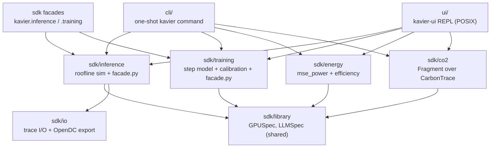
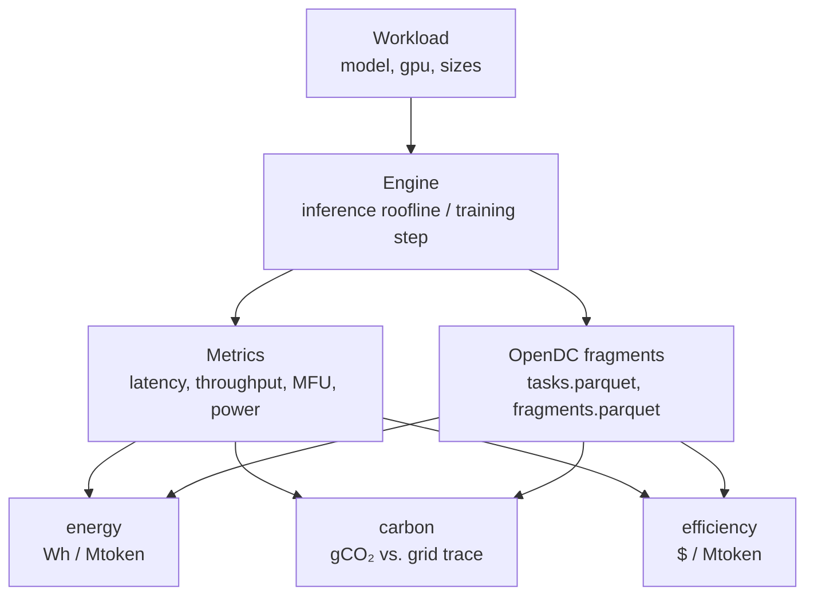
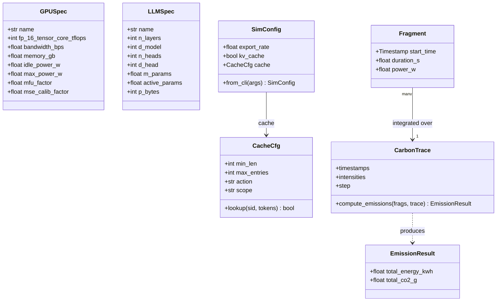

# Architecture

What Kavier contains and how it is laid out: three surfaces (**cli**, **ui**, **sdk**) over two
engines and one shared library, and the pipeline that turns a workload into performance,
sustainability, and efficiency numbers.

Kavier is a single importable package, `kavier`, with exactly three top-level parts. The diagrams
on this page are derived from the codebase (extracted with `pyreverse` over `src/kavier`) and drawn
to match the real classes, functions, and imports.

## The three surfaces {#layout}

All modelling lives in `sdk/`. The `cli/` and `ui/` packages are thin *adapters*: they collect
inputs and render output, but hold no simulation logic of their own — they call the same SDK verbs
and engines you can call from Python.

Every engine reads the **library**; only training reads **calibration**. The `kavier <cmd>` CLI,
the `kavier-ui` REPL, and the `kavier.inference` / `kavier.training` SDK verbs are three front doors
to the same engines.

## Verbs, facades & aliases {#verbs}

The public API is four verbs on two workload namespaces:
`kavier.inference.{performance, energy, efficiency, carbon}` and the `kavier.training.*`
equivalents. Each takes a *batch* (a DataFrame, a `list[dict]`, or a single `dict`) and returns the
input rows plus predicted columns.

- The verbs are implemented in `src/kavier/sdk/inference/facade.py` and
  `src/kavier/sdk/training/facade.py`, and **re-exported lazily** from each `sdk` subpackage
  (pandas/numpy and the cross-engine chain load only on first verb access).
- `kavier.inference` / `kavier.training` are convenience **aliases** for `kavier.sdk.inference` /
  `kavier.sdk.training`. There is **no import hook** and there are no top-level `kavier_`
  packages — everything lives under `src/kavier/`.
- `import kavier` is lazy (PEP 562), so it stays cheap and keeps the calibration accessor
  importable without scipy/sklearn/numpy/pandas.

## How the CLI dispatches {#dispatch}

The unified command is a tiny router. `cli/main.py` holds a `_COMMANDS` table that maps each
subcommand to a lazy handler which imports and calls that engine's own parser — so
`kavier <cmd> --help` shows that command's real flags and behaves exactly like a standalone tool.

| Subcommand | Entry point | Core call |
|------------|-------------|-----------|
| `kavier inference` | `kavier.sdk.inference.cli:main` | `core.service.run_performance` |
| `kavier training` | `kavier.sdk.training.cli:main` | `core.engine.simulate_full_training` |
| `kavier energy` | `kavier.sdk.energy.calculator:main` | `energy.metrics.efficiency_summary` |
| `kavier carbon` | `kavier.sdk.co2.cli:main` | `co2.engine.compute_emissions` |

The interactive REPL is a separate entrypoint (`kavier-ui` / `python -m kavier.ui`) and the CLI is
also `python -m kavier`.

## The data-flow pipeline {#pipeline}

A workload row flows through an engine into per-request or per-step metrics (plus an
OpenDC-compatible `tasks` / `fragments` export), which the sustainability and efficiency verbs chain
into energy, carbon, and cost:

!!! warning "Two sustainability paths"

    Two sustainability paths share no code (a documented limitation): the **self-contained facade
    estimate** bills a flat synthetic trace directly from the engine's power, while the **OpenDC
    read-back path** (`kavier energy`) sums an external `powerSource.parquet` produced by OpenDC.
    The two can disagree for the "same" run.

## Core domain objects (class map) {#domain}

These are the real classes the engines pass around, extracted from the source. Each component page
drills into its own classes and functions; this is the shared spine.

Relationships: `SimConfig` *has-a* `CacheCfg`, which configures a `PrefixCache` (`action` is one of
`none` / `prefill` / `full`; `scope` is `session` / `global`); the training and inference engines
both *read* `GPUSpec` and `LLMSpec`; the carbon engine integrates `Fragment`s over a `CarbonTrace`
to produce an `EmissionResult`. `active_params <= m_params` (equal for dense models, smaller for
MoE).

## Module dependencies {#deps}

The import graph is layered and acyclic in the intended direction — surfaces depend on engines,
engines depend on the library, and the library depends on nothing else in the tree. A couple of
edges are worth knowing:

- `sdk/training/facade.py` reuses helpers from `sdk/inference/facade.py` (`_normalise`,
  `_flat_trace`, `_with_columns`) so the two verb families return identically-shaped frames.
- `sdk/training/core/engine.py` imports `mse_power` from `sdk/energy` and the calibration accessors
  from `sdk/training/calibration`.
- `sdk/co2` builds `Fragment`s from a training sim (`fragments_from_training`) or from an OpenDC
  `powerSource.parquet` (`fragments_from_powersource`).

!!! note "Regenerate the diagrams"

    The class/module structure was extracted with
    `uv run --with pylint pyreverse -my -o dot -p kavier -d /tmp/uml src/kavier`. Re-run it after a
    refactor and reconcile any drift against these figures.
