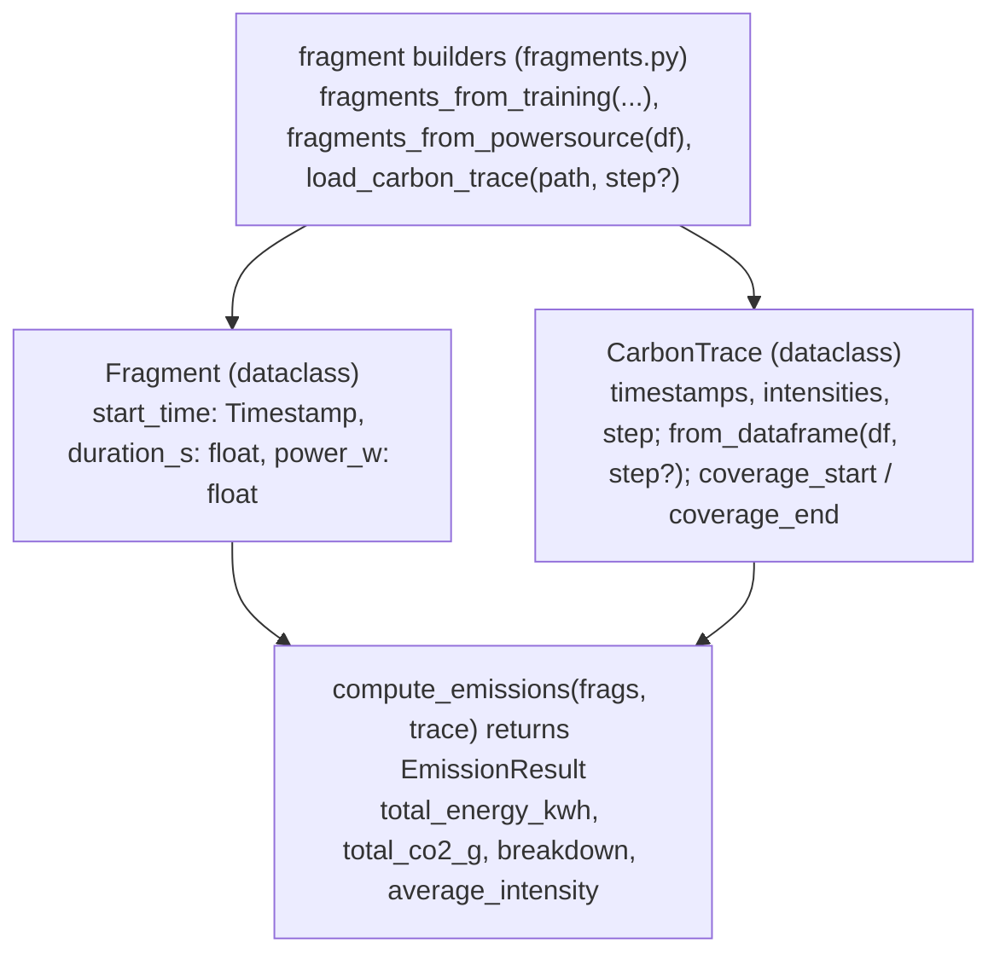

# CO₂

Walk a workload's power profile through a carbon-intensity trace (gCO₂/kWh over time) to estimate
total emissions — window by window, because *when* and *where* a job runs changes its footprint.

## Overview {#overview}

The carbon component integrates **power over time** against a **time-varying grid intensity**. Its
three data structures (`sdk/co2/engine.py`) are:

- `Fragment` — a constant-power interval: a naive `start_time`, a `duration_s`, and `power_w`.
- `CarbonTrace` — a piecewise-constant timeline of intensities (gCO₂/kWh), each applying over a
  half-open window.
- `EmissionResult` — the totals (kWh, gCO₂) plus a per-window breakdown.

`compute_emissions` slices each fragment across the trace's windows and sums `energy x intensity`.
Fragments come from either engine: a training run's predicted power times runtime, or an OpenDC
`powerSource.parquet` read back from an inference run.

!!! note "Down-estimation"

    Within a window that has a successor, Kavier bills at the **lower** of the current and next
    window's intensity — a deliberately conservative (down-estimating) choice. The energy-weighted
    average intensity in the output reflects when the job actually drew power, not a flat grid
    average.

## How to use it {#use}

### CLI {#cli}

Exactly one power source is required: `--from-training` (build the profile from a training config)
**or** `--powersource` (read an OpenDC `powerSource.parquet`).

```bash
# From a training config:
uv run kavier carbon --from-training \
  --carbon_trace      ct1-2025-ie-carbon-intensity.parquet \
  --model_name        mistral-7b-v0.1 --method lora \
  --gpu_model         NVIDIA-A100-SXM4-80GB \
  --tokens_per_sample 1024 --batch_size 4 \
  --number_gpus       8 --number_nodes 1 \
  --total_tokens      100000000 \
  --start_time        '2025-06-01 00:00' \
  --output_csv        emissions_breakdown.csv

# From an OpenDC power profile (e.g. an inference run):
uv run kavier carbon \
  --carbon_trace carbon_trace.parquet \
  --powersource results/run-01/powerSource.parquet
```

| Flag / Option | Type | Default | Description |
|---------------|------|---------|-------------|
| `--carbon_trace` | `path` | **required** | Carbon-intensity Parquet (gCO₂/kWh), timezone-naive timestamps. |
| `--carbon_step_minutes` | `int` | *(inferred)* | Override the inferred trace step. |
| `--from-training` | `flag` | — | Build fragments from a training sim (mutually exclusive with `--powersource`). |
| `--powersource` | `path` | — | Read an OpenDC `powerSource.parquet`. |
| `--output_csv` | `path` | *(unset)* | Write the per-window breakdown to CSV. |

With `--from-training`, the usual training-job flags are also required (`--model_name`, `--method`,
`--gpu_model`, `--tokens_per_sample`, `--batch_size`, `--number_gpus`, `--number_nodes`, a job size,
and `--start_time`).

```text
============================================================
Kavier CO2 Emissions
============================================================
Total energy:        312.5000 kWh
Total CO2:           87,500.00 g  (87.5000 kg)
Avg intensity used:  280.00 gCO2/kWh (energy-weighted)
Windows touched:     48
============================================================
```

With `--output_csv`, each row is one window: `window_start, carbon_intensity, energy_kwh, co2_g`.

### SDK {#sdk}

The `carbon` verb bills GPU power against a flat intensity (default 400 gCO₂/kWh, or an `intensity`
column) — a self-contained estimate that needs no external trace:

```python
import kavier

kavier.inference.carbon(batch)  # + total_co2_g, total_co2_kg, carbon_per_mtoken_g
kavier.training.carbon(batch)   # same columns, billed from the training engine's power
```

### UI {#ui}

The `kavier-ui` REPL can chain a performance run straight into a carbon estimate using the
self-contained flat-intensity path.

## Underlying architecture {#architecture}

The engine is three frozen dataclasses plus `compute_emissions`. The `fragments.py` module builds
the `Fragment` list from either source; the `kavier carbon` CLI (`cli.py`) wires them to a loaded
`CarbonTrace`.



`fragments_from_training` calls the [training engine](performance.md#training) for power times
runtime; `fragments_from_powersource` derives per-timestamp power from an OpenDC parquet.
`compute_emissions` integrates the fragments over the `CarbonTrace` and raises if a fragment falls
outside the trace's coverage.

## Formulas {#formulas}

**C1 — Windowed energy & emissions**

$$
\text{energy\_kWh} = \frac{\text{power\_w} \times \text{seg\_seconds}}{3.6 \times 10^6}
$$

$$
\text{CO}_2\text{\_g} = \sum_\text{windows} \text{energy\_kWh}(w) \times \text{intensity}(w)
$$

*Source:* carbon-intensity emissions accounting —
[Niewenhuis et al. (2024) — FootPrinter](https://doi.org/10.1145/3578244.3583730); the underlying
power comes from the [OpenDC MSE model](energy.md)
([Mastenbroek et al., 2021](https://doi.org/10.1109/CCGrid51090.2021.00069)).

- Each fragment is sliced at the trace's own window boundaries; `3.6e6` is watt-seconds per kWh.

**C2 — Down-estimated window intensity**

$$
\text{intensity}(w) = \min\big(\text{intensity}[w],\ \text{intensity}[w+1]\big) \quad \text{(final window: } \text{intensity}[w]\text{)}
$$

*Rationale:* a conservative lower bound between two known grid samples; the last window has no
successor, so it uses its own value and spans exactly one step.

**C3 — Energy-weighted average intensity**

$$
\text{avg\_intensity} = \frac{\text{total\_CO}_2\text{\_g}}{\text{total\_energy\_kWh}}
$$

Reflects *when* the job drew power, not a flat mean of the trace.

## Limitations & accuracy {#limitations}

- **Down-estimation is a modelling choice.** Billing at the lower of two adjacent intensities
  systematically under-estimates against a mid-point interpolation — intentional, but know it is a
  bound.
- **Coverage is strict.** A fragment outside the trace's `[start, end)` raises; the trace must cover
  the whole run.
- **Timezone-naive only.** Both fragment and trace timestamps must be naive; mixing tz-aware
  timestamps is rejected to avoid silent offset errors.
- **Inherited power error.** Emissions are only as good as the power profile feeding them — MoE
  inference over-predicts power, so its carbon over-predicts too (see
  [Performance limitations](performance.md#limitations)).

## How to contribute to it {#contribute}

- **Emission logic:** edit `sdk/co2/engine.py`. The core invariant is that per-window energy *tiles*
  the fragment duration exactly (fragments sum to the total). See
  `tests/test_co2/test_emissions_invariants.py` and `test_emissions.py`.
- **Fragment builders:** edit `sdk/co2/fragments.py`; tested by `tests/test_co2/test_fragments.py`.
  The CLI is covered by `test_cli.py`.
- **Invariant pattern:** assert non-negativity, that windows tile the duration, and that a
  constant-intensity trace reduces to `energy x flat_intensity`.

```bash
uv run pytest tests/test_co2 -q
uv run pytest tests/test_co2/test_emissions.py -q -k irregular   # single -k filter
```
