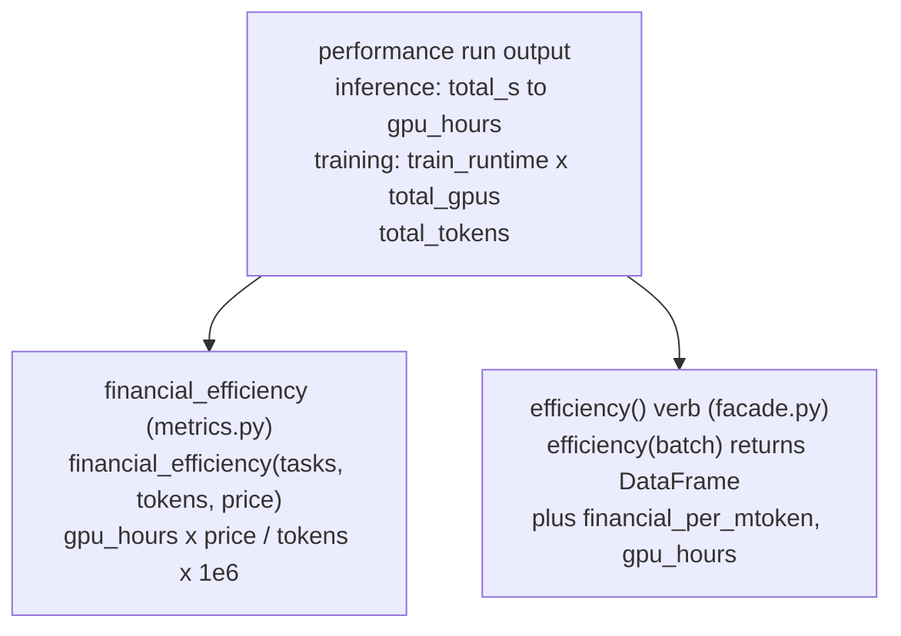

# Efficiency

The cost verb: dollars per million tokens, from GPU-hours times a GPU-hour price. It is a **derived
metric**, not a standalone engine — it layers a price on top of the performance a workload already
predicts.

## Overview {#overview}

!!! note "Not an engine"

    Efficiency has **no simulator of its own**. It reuses the runtime/GPU-hours a
    [performance](performance.md) run already produced and multiplies by a price. This is why it
    lives as the `efficiency` verb and as the `--price` flag on [kavier energy](energy.md), rather
    than as a top-level command.

The unit is **`$/Mtoken`** — the industry-standard way to compare serving and fine-tuning cost.
"GPU-hours" is the wall-clock runtime times the number of GPUs; multiply by the GPU-hour rate and
divide by the tokens processed:

- **Inference:** `gpu_hours = total_busy_seconds / 3600` (single GPU per request).
- **Training:** `gpu_hours = train_runtime_s / 3600 x total_gpus`.

Alongside cost, "efficiency" is the umbrella for the two sustainability ratios too — energy per
million tokens and carbon per million tokens — computed on the [energy](energy.md) page.

## How to use it {#use}

### CLI {#cli}

Cost surfaces as the `financial_efficiency ($/Mtoken)` line of `kavier energy`, emitted **only** when
you pass `--price` (there is no default price):

```bash
uv run kavier energy \
  --kavier results/run-01/tasks.parquet \
  --opendc opendc/run-01/powerSource.parquet \
  --price  12.0            # GPU-hour price -> enables the $ metric
```

```text
----------  Efficiency summary  ----------
   energy_efficiency (Wh/Mtoken): 84.5
 carbon_efficiency (gCO2/Mtoken): 39.0
 financial_efficiency ($/Mtoken): 2.36
                    total_tokens: 1234567
------------------------------------------
```

Without `--price`, the cost line reads `N/A` and only the energy/carbon ratios print.

### SDK {#sdk}

The `efficiency` verb returns cost per million tokens directly. The GPU-hour price comes from a
`gpu_hour_price` column if present, else defaults to **2.5**:

```python
import kavier

kavier.inference.efficiency(batch)  # + financial_per_mtoken ($/Mtoken), gpu_hours
kavier.training.efficiency(batch)   # + financial_per_mtoken ($/Mtoken), gpu_hours
```

### UI {#ui}

The `kavier-ui` REPL includes the cost estimate in its post-run summary when a GPU-hour price is
supplied.

## Underlying architecture {#architecture}

The derivation is a one-liner in two places: the CLI metric
(`sdk/energy/metrics.py::financial_efficiency`) and the SDK verb (`facade.efficiency`, which reuses
the performance run's GPU-hours). Both feed off the same performance output — there is no separate
model.



A flow, not a class hierarchy: performance to GPU-hours, times price, divided by tokens, giving
`$/Mtoken`. The same arithmetic backs the CLI metric and the SDK verb, so their numbers agree on a
matching basis.

## Formulas {#formulas}

**Financial efficiency (`$/Mtoken`)**

$$
\text{financial\_efficiency} = \frac{\text{GPU\_hours} \times \text{price\_per\_GPU\_hour}}{\text{total\_tokens}} \times 10^6
$$

*Source:* standard total-cost-of-ownership accounting for accelerator time; per-Mtoken is the
industry reporting unit. Electricity (~2-5%) is folded into the GPU-hour rate, not modelled
separately.

- Inference: `GPU_hours = sum(per-request seconds) / 3600` (one GPU per request).
- Training: `GPU_hours = train_runtime_s / 3600 x total_gpus`.

**Companion sustainability ratios**

$$
\text{energy\_per\_Mtoken} = \frac{\text{energy\_Wh}}{\text{tokens}} \times 10^6
\qquad
\text{carbon\_per\_Mtoken} = \frac{\text{CO}_2\text{\_g}}{\text{tokens}} \times 10^6
$$

*See:* [Energy formulas](energy.md#formulas) for how the numerators are computed.

## Limitations & accuracy {#limitations}

- **As accurate as its inputs.** Cost inherits all the runtime/throughput error of the performance
  engine feeding it — a derived metric can be no better than its base.
- **Price is exogenous.** Kavier does not know real GPU-hour prices; you supply `--price` /
  `gpu_hour_price`. The SDK's default of 2.5 is a placeholder.
- **Electricity not separated.** The ~2-5% electricity share is assumed folded into the GPU-hour
  rate rather than added on top.
- **Single GPU type per run.** Like the engines, the cost basis assumes a homogeneous fleet.

## How to contribute to it {#contribute}

- **Cost logic:** edit `sdk/energy/metrics.py::financial_efficiency` (the CLI metric) and the
  `efficiency` verbs in `sdk/inference/facade.py` / `sdk/training/facade.py` (keep the two GPU-hour
  bases in sync).
- **Test it** with `tests/test_inference/test_financial_efficiency.py`, which hand-derives expected
  `$/Mtoken` from a known GPU-hours x price, and the API tests in `tests/test_api/` that exercise the
  verbs end-to-end.

```bash
uv run pytest tests/test_inference/test_financial_efficiency.py tests/test_api -q
```
