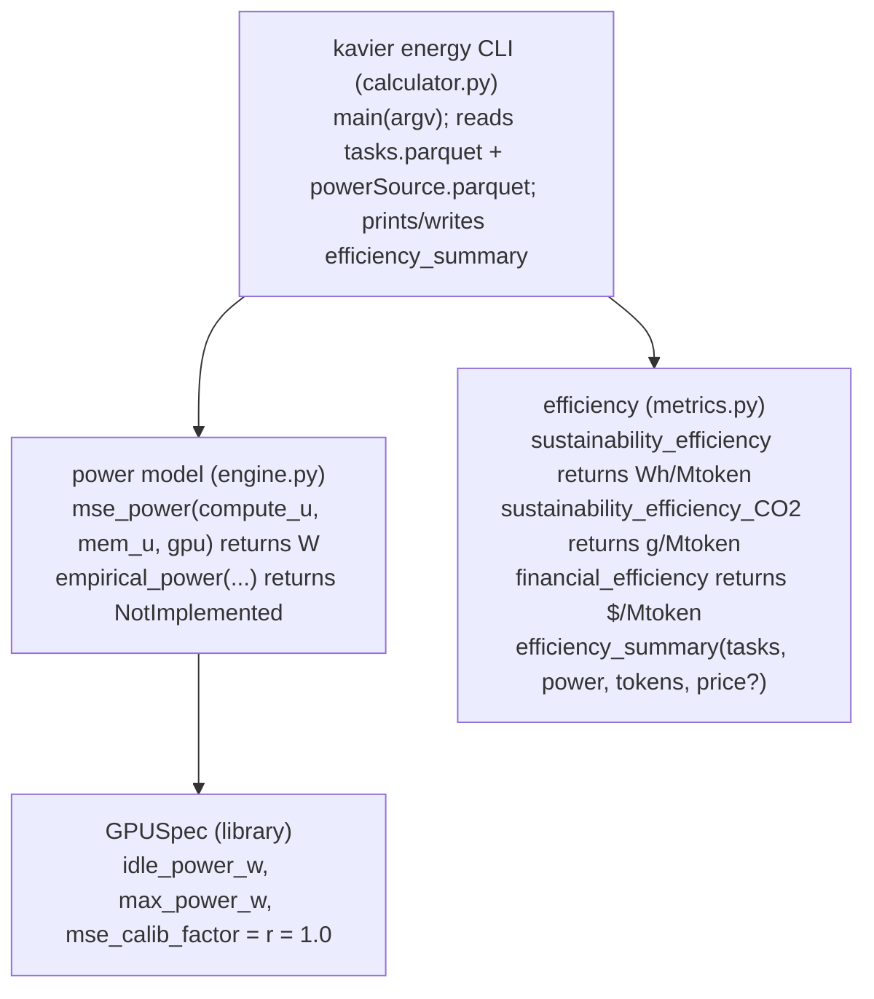

# Energy

The shared GPU power model — `mse_power(u)`, Kavier's implementation of OpenDC's MSE curve — and
the per-million-token energy metric derived from a run's power over time.

## Overview {#overview}

The energy component has two layers. At the bottom is a **GPU power model**
(`sdk/energy/engine.py::mse_power`): given a utilisation and a `GPUSpec`, it returns the
instantaneous watts. On top sits an **efficiency layer** (`sdk/energy/metrics.py`) that turns
power-over-time into **Wh per million tokens** (and, alongside it, carbon and cost per million
tokens).

A subtlety worth internalising: the two engines bill power from **different bases**.

<div class="grid cards" markdown>

-   __Inference__

    bills the GPU's **max power (TDP)** over the summed busy time — a conservative upper envelope.

-   __Training__

    bills the calibrated **`mse_power`** at the run's utilisation — lower than TDP at partial load.

</div>

So two "same-looking" energy numbers can rest on different power bases. Because every shipped GPU
has `mse_calib_factor = r = 1.0`, the MSE curve is in practice a **linear ramp** from idle to max.

!!! warning "Two divergent energy paths"

    Energy can come from the **self-contained facade estimate** (a flat synthetic trace billed
    directly from GPU power — used by the SDK/UI) *or* from the **OpenDC read-back path**
    (`kavier energy` sums an external `powerSource.parquet`). The two paths share no code and can
    return different energy for the same workload — a known, documented limitation, not a bug.

## How to use it {#use}

!!! note "Renamed in 0.5.0"

    The old `kavier-energy` / `kavier-eff` console scripts are now the `kavier energy` subcommand
    documented here.

### CLI — the OpenDC read-back path {#cli}

Post-process a run: take a Kavier `tasks.parquet` and the matching OpenDC `powerSource.parquet`, and
get three per-million-token metrics (all lower-is-better):

```bash
uv run kavier energy \
  --kavier results/run-01/tasks.parquet \
  --opendc opendc/run-01/powerSource.parquet \
  --price  12.0 \
  --out    results/run-01/efficiency_summary.json
```

| Flag / Option | Type | Default | Description |
|---------------|------|---------|-------------|
| `--kavier` | `path` | **required** | `tasks.parquet` from `kavier inference` (must keep its `total_tokens` column). |
| `--opendc` | `path` | **required** | `powerSource.parquet` from the matching OpenDC run. |
| `--price` | `float` | *(unset)* | GPU-hour price. **No default** — financial efficiency is reported only when set. |
| `--out` | `FILE.json` | *(unset)* | If set, also writes the summary as JSON. |

```text
----------  Efficiency summary  ----------
   energy_efficiency (Wh/Mtoken): 84.5
 carbon_efficiency (gCO2/Mtoken): 39.0
 financial_efficiency ($/Mtoken): 2.36
                    total_tokens: 1234567
------------------------------------------
```

### SDK — the self-contained estimate {#sdk}

The `energy` verb needs no OpenDC round-trip; it bills GPU power over the modelled busy time:

```python
import kavier

kavier.inference.energy(batch)  # + energy_wh, energy_kwh, energy_per_mtoken_wh, tokens_per_wh
kavier.training.energy(batch)   # + energy_wh, energy_per_mtoken_wh, aggregate_power_w
```

### UI {#ui}

The `kavier-ui` REPL surfaces the self-contained energy estimate directly after a performance run,
so you can compare configurations without exporting to OpenDC.

## Underlying architecture {#architecture}

The power model is a single pure function over a `GPUSpec`; the efficiency metrics are pure
functions over two DataFrames; the `kavier energy` CLI (`calculator.py`) glues them to parquet I/O.



`mse_power` reads `idle_power_w`, `max_power_w` and `mse_calib_factor` from the
[library](library.md); the training engine calls it every step. `efficiency_summary` is what the
`kavier energy` CLI prints, and what the SDK's `energy` / `efficiency` verbs mirror.

## Formulas {#formulas}

Energy reuses [OpenDC](https://opendc.org/)'s MSE power model — Kavier's implementation matches
OpenDC's to within floating-point error, at far higher speed.

**E1 — Power draw (OpenDC MSE model)**

$$
P(u) = P_\text{idle} + (P_\text{max} - P_\text{idle}) \times (2u - u^r)
$$

*Source:* non-linear power–utilisation model —
[Fan et al. (2007) — Power provisioning for a warehouse-sized computer](https://doi.org/10.1109/ISCA.2007.18);
[Mastenbroek et al. (2021) — OpenDC](https://doi.org/10.1109/CCGrid51090.2021.00069).

- `u` = utilisation (max of compute and memory); `r = mse_calib_factor`, a per-GPU exponent.
- Every shipped GPU has `r = 1.0`, so `2u - u^1 = u` — a linear ramp from idle to max.
- Defaults when unset: `idle = 0.25 x base_power`, `max = base_power` (TDP).

**E2 — Energy & emissions**

$$
\text{energy\_kWh} = \frac{P(u) \times \text{duration}}{3.6 \times 10^6}
\qquad
\text{CO}_2\text{\_g} = \text{energy\_kWh} \times \text{intensity}(t)
$$

*Source:* integrate power over time — see [CO₂](co2.md);
[Niewenhuis et al. (2024) — FootPrinter](https://doi.org/10.1145/3578244.3583730).

- OpenDC's `energy_usage` is in **joules**; Kavier divides by 3600 to get Wh.

**E3 — Per-million-token efficiency**

$$
\text{energy\_efficiency} = \frac{\sum \text{energy\_Wh}}{\text{total\_tokens}} \times 10^6
$$

$$
\text{carbon\_efficiency} = \frac{\sum \text{CO}_2\text{\_g}}{\text{total\_tokens}} \times 10^6
$$

*Source:* per-Mtoken is the industry-standard reporting unit (raw per-token values are tiny).
Financial efficiency is the [derived cost verb](efficiency.md).

## Limitations & accuracy {#limitations}

- **Two energy methodologies can disagree.** The self-contained GPU-power estimate (SDK/UI) and the
  external OpenDC power simulation can return different energy for the same workload; the OpenDC path
  is generally the more precise.
- **Different power bases.** Inference bills TDP; training bills calibrated `mse_power`. Compare
  energy across the two engines with care.
- **Only power is validated.** Kavier's `mse_power` reproduces OpenDC's model to floating-point
  error, but the *utilisation* that feeds it inherits the engines' own limitations.
- **Electricity price omitted from cost.** Financial efficiency counts GPU-hours times rate only;
  the ~2-5% electricity share is not separately modelled.

## How to contribute to it {#contribute}

- **Power model:** edit `sdk/energy/engine.py`. The invariant to preserve is `P(u)` in
  `[idle, max]` and monotonic in `u`. `empirical_power` is a stub awaiting a measured
  utilisation-to-watts table per GPU — wiring one up is a good contribution.
- **Efficiency metrics:** edit `sdk/energy/metrics.py`. Unit conversions are load-bearing (joules to
  Wh, ms to h) — see the regression tests
  `tests/test_inference/test_energy_unit_regressions.py` and `test_sustainability_efficiency.py` /
  `test_financial_efficiency.py`, which cite the issues they guard and hand-derive expected values.
- **Test it** with the library-wide power invariant (`power` in `[idle, max]`) and the metric
  regressions:

```bash
uv run pytest tests/test_inference/test_sustainability_efficiency.py tests/test_inference/test_energy_unit_regressions.py -q
```
