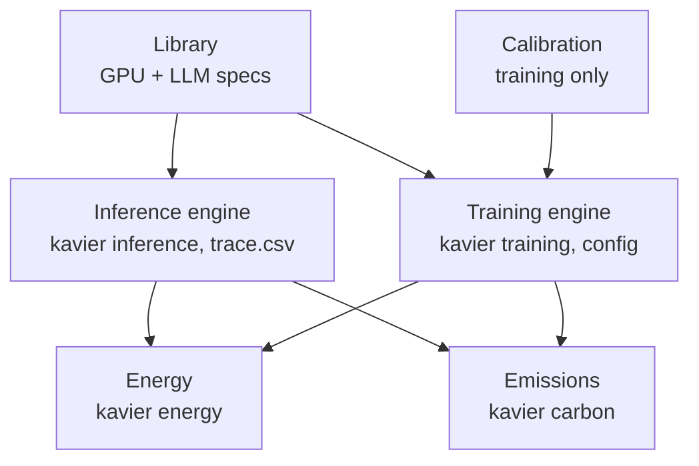

# Kavier

**Predict the performance, sustainability, and efficiency of LLM workloads.**

Describe a workload — a model, a GPU, and the request or job sizes — and Kavier estimates how it
will behave **before you run it on real hardware**: latency, throughput, utilization, energy,
carbon, and cost, computed analytically.

[Get started](getting-started.md){ .md-button .md-button--primary }
[Architecture](architecture.md){ .md-button }
[Performance](performance.md){ .md-button }

## What Kavier is {#what}

Kavier is a research instrument from [AtLarge Research](https://atlarge-research.com/) for
**sizing LLM workloads without running them**. Operating a large model — serving inference or
fine-tuning — burns GPU-hours, energy, and money, and the design space (which GPU, how many, which
fine-tuning method, what batch size) is large and expensive to explore empirically. Kavier replaces
the hardware experiment with a fast *analytical* model: it takes a workload description and returns
the metrics that decide whether a plan is viable, in milliseconds, so you can sweep thousands of
configurations.

It is built for **operators, researchers, and engineers** who need planning estimates: capacity
planners choosing hardware, sustainability researchers comparing carbon footprints, and engineers
deciding between LoRA and full fine-tuning. Every number is a *prediction*, not a measurement —
treat Kavier as a planning tool, not ground truth (see the [accuracy note](#validation) below).

## What it predicts {#predicts}

Kavier answers three families of question about a workload, across both inference (serving) and
training (fine-tuning):

<div class="grid cards" markdown>

-   __Performance__

    Inference latency (prefill / decode, p50 / p95) and throughput; training step throughput,
    runtime, and GPU utilization (MFU).

-   __Sustainability__

    Energy drawn (Wh) and carbon emitted (gCO₂), integrated against a time-varying grid-intensity
    trace.

-   __Efficiency__

    Cost per million tokens ($/Mtoken) from GPU-hours and a GPU-hour price — and energy / carbon
    per million tokens.

</div>

## The mental model: two predictors, one library {#mental-model}

Inference and training are **different problems**, so Kavier keeps them in two separate engines
that share a single catalog of hardware and model specs:

<div class="grid cards" markdown>

-   __Inference__

    A per-request roofline simulator. Splits each request into a compute-bound **prefill** and a
    memory-bandwidth-bound **decode**, tracking KV-cache memory. Predicts latency, p95, and
    throughput.

-   __Training__

    A first-principles model of one fine-tuning step (forward + backward + optimizer + all-reduce),
    scaled by fitted **calibration** factors. Predicts step throughput, runtime, MFU, and power.

</div>

Both engines feed the shared **sustainability** and **efficiency** layers — energy, carbon, and
cost per million tokens — which reuse the peer-reviewed [OpenDC](https://opendc.org/) power model.
The same set of verbs (`performance`, `energy`, `efficiency`, `carbon`) is exposed three ways: a
one-shot CLI, a Python SDK, and an interactive UI.

## Explore the components {#components}

<div class="grid cards" markdown>

-   __[Performance](performance.md)__

    The two prediction engines — the discrete per-request inference roofline and the analytical
    training-step model.

-   __[Energy](energy.md)__

    The shared OpenDC MSE GPU-power model, and per-million-token energy from a run's tasks + power.

-   __[CO₂](co2.md)__

    Power fragments integrated over a carbon-intensity trace (gCO₂/kWh) to estimate emissions.

-   __[Efficiency](efficiency.md)__

    The derived cost verb — GPU-hours times price divided by tokens — layered on top of performance.

-   __[Library](library.md)__

    The static catalog of GPU and LLM specifications every engine reads from.

</div>

## How it fits together {#architecture}



The **library** feeds both engines; **calibration** applies to training only. The inference engine
can also export an OpenDC-compatible workload; OpenDC's `powerSource.parquet` then flows into
`kavier energy`. The full picture — the cli / ui / sdk layering and the class-level data flow — is
on the [Architecture](architecture.md) page.

## What it has been validated against {#validation}

The analytical training model is the one with published accuracy numbers. On the held-out 15% test
split of a ~30k-run fine-tuning profiling dataset, and only for the specific models and GPUs it was
calibrated on:

<div class="grid cards" markdown>

-   __~6.2% MdAPE__

    calibrated training model (throughput & runtime), down from ~15% uncalibrated.

-   __~0.8 ms__

    to make 100 training predictions — fast enough for million-point grid sweeps.

-   __~0 delta__

    power vs. OpenDC's MSE model (Kavier reuses it), at far higher speed.

</div>

## Structure {#structure}

One package, `kavier`, with three top-level parts — the CLI, the UI, and the SDK:

```text
src/kavier/
  cli/            # the unified `kavier` command (inference/training/energy/carbon)
  ui/             # interactive REPL (the `kavier-ui` command)
  sdk/            # the functionality — one subpackage per domain
    inference/    # per-request inference simulator + verb facade (kavier.inference)
    training/     # analytical fine-tuning model + calibration (kavier.training)
    energy/       # GPU power model + per-Mtoken efficiency
    co2/          # emissions vs. a carbon trace
    io/           # shared I/O + OpenDC export (io/opendc/)
    library/      # shared GPU & LLM specifications
tests/            # test suites (uv run pytest)
```

## Quick start {#install}

```bash
git clone https://github.com/atlarge-research/kavier.git
cd kavier

uv sync
```

Run your first (inference) simulation:

```bash
uv run kavier inference --trace src/kavier/sdk/inference/data/input/input_example.csv
```

That writes Parquet artifacts and prints a summary. See [Getting started](getting-started.md) for
the full tour.

---

Kavier is distributed under the MIT license. See [LICENSE.txt](https://github.com/atlarge-research/kavier/blob/master/LICENSE.txt).
