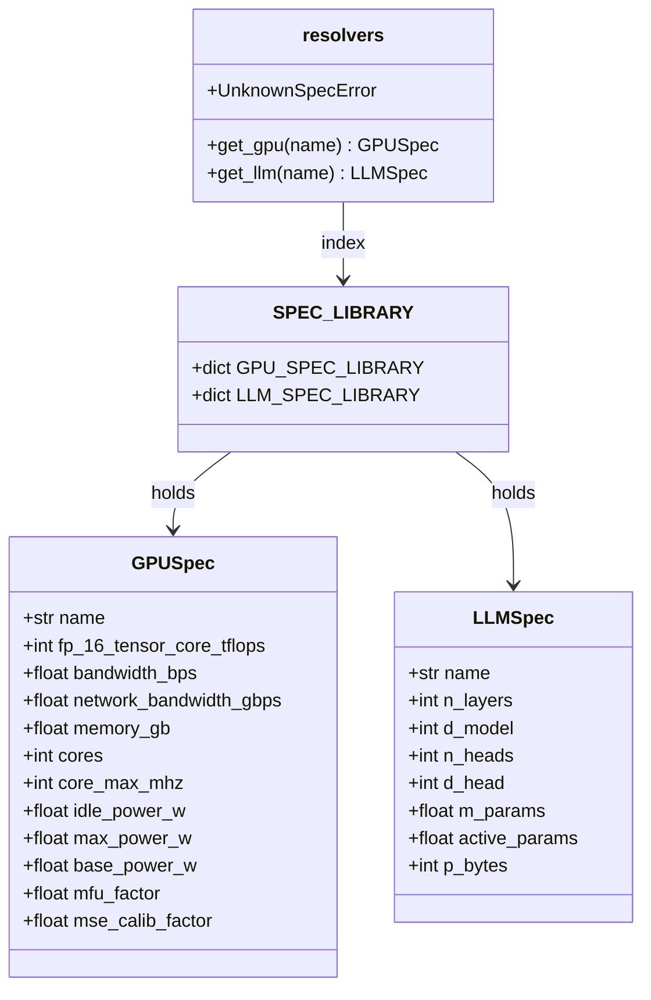

# Library

The static catalog of GPU and LLM specifications every engine reads from — the domain entities that
turn a name like `"A100-80GB"` into the numbers the formulas need.

## Overview {#overview}

The library (`sdk/library/`) is pure data plus name resolution. Two small classes hold the specs:

- `GPUSpec` — TFLOPS, memory bandwidth, memory size, clocks/cores, power (idle/max), MFU factor,
  network bandwidth, and the MSE power exponent.
- `LLMSpec` — layers, hidden dim, heads, precision bytes, total params (`m_params`) and per-token
  `active_params` (lower than total for MoE).

Two module-level dicts hold the catalog — `GPU_SPEC_LIBRARY` (11 entries) and `LLM_SPEC_LIBRARY`
(16 entries) — and `lookup.py` resolves names into specs.

!!! warning "Exact-match, case-sensitive, no aliases"

    Lookups are literal dict lookups. `A100-80GB` and `NVIDIA-A100-80GB-PCIe` are **distinct keys**;
    there is no fuzzy matching. An unknown name raises `UnknownSpecError`, whose message lists the
    available names. This is also why [training calibration](performance.md#training) — keyed on the
    *full* names — silently neutralises when you pass a short inference key.

## How to use it {#use}

### The catalog {#catalog}

| Kind | Available keys |
|------|----------------|
| `GPU_SPEC_LIBRARY` | `A10`, `A100-40GB`, `A100-80GB`, `L4`, `L40S`, `H100-PCIe`, `H100-SXM`, `H200 SXM`, `NVIDIA-A100-80GB-PCIe`, `NVIDIA-H100-PCIe`, `NVIDIA-A100-SXM4-80GB` |
| `LLM_SPEC_LIBRARY` | `Llama-3-8B`, `Llama-2-13B`, `Granite-20B`, `MPT-30B`, `OPT-30B`, `OPT-175B`, `BLOOM-176B`, `llama3.1-70b`, `granite-3.1-3b-a800m-instruct`, `mistral-7b-v0.1`, `mixtral-8x7b-instruct-v0.1`, `granite-3.3-8b`, `llama3.2-3b`, `granite-3-8b`, `granite-3.1-8b-instruct`, `granite-3.1-2b` |

*Only the full-name GPU keys (e.g. `NVIDIA-A100-SXM4-80GB`) and a handful of models are in the
training calibration fit-set; the rest run uncalibrated.*

### CLI & UI {#cli}

You reference specs by name on the command line: `--gpu` / `--llm` for inference, `--gpu_model` /
`--model_name` for training. The `kavier-ui` REPL presents both catalogs as searchable menus (sorted
by size), so you never need to memorise a key.

```bash
uv run kavier inference --gpu A100-80GB --llm mistral-7b-v0.1 --trace …
```

### SDK {#sdk}

Resolve specs directly, or just pass names into a batch and let the verbs resolve them:

```python
from kavier.sdk.library import get_gpu, get_llm, GPU_SPEC_LIBRARY, LLM_SPEC_LIBRARY

gpu = get_gpu("A100-80GB")          # -> GPUSpec; raises UnknownSpecError if absent
llm = get_llm("mistral-7b-v0.1")    # -> LLMSpec
list(GPU_SPEC_LIBRARY)                # the available GPU keys
```

## Underlying architecture {#architecture}

Two plain classes, two dicts, three resolver functions. No behaviour beyond construction and lookup.



`get_gpu` / `get_llm` index the `*_SPEC_LIBRARY` dicts; a miss raises `UnknownSpecError`. Every
engine — inference stages, training step, energy power model — consumes these two spec types.

!!! warning "Specs do no validation"

    `GPUSpec` / `LLMSpec` constructors just store fields. All invariants — positive fields,
    `idle <= max`, `key == name`, `0 < active_params <= m_params`, unit conversions — are enforced
    entirely by `tests/test_library/test_spec_consistency.py`, parametrized over the whole catalog.
    A new entry is validated the moment you add it.

## Formulas {#formulas}

The library computes almost nothing — it stores inputs. Two conversions and one default happen at
construction, and every field then feeds a formula elsewhere:

**L1 — Derived spec fields**

$$
\text{bandwidth\_bps} = \text{memory\_bandwidth\_gbps} \times 10^9 \quad \text{(GB/s to bytes/s)}
$$

$$
\text{idle\_power\_w} = 0.25 \times \text{base\_power\_w} \qquad \text{max\_power\_w} = \text{base\_power\_w} \quad \text{(when unset)}
$$

$$
\text{active\_params} = \text{m\_params} \quad \text{(when unset: dense; MoE sets it lower)}
$$

These are the only computations the library performs; everything else is a stored constant.

| Spec field | Feeds |
|------------|-------|
| `fp_16_tensor_core_tflops` | Prefill / decode / forward FLOP time ([P1, P2, T1](performance.md#formulas)). |
| `bandwidth_bps` | Decode memory-bound term, AdamW optimizer time ([P2, T3](performance.md#formulas)). |
| `active_params` / `m_params` | FLOPs (active) and optimizer/comm (total); MoE-awareness. |
| `idle_power_w` / `max_power_w` / `mse_calib_factor` | The MSE power curve ([E1](energy.md#formulas)). |
| `mfu_factor` | Base MFU for the training step ([T6](performance.md#formulas)). |
| `core_max_mhz` x `cores` | OpenDC `gpu_capacity` for the exported task. |

## Limitations & accuracy {#limitations}

- **Specs are only as good as their sources.** Numbers are curated from datasheets; real-world
  sustained throughput differs from peak, which the efficiency constants and calibration try to
  absorb.
- **MoE is a single scalar.** Sparsity is encoded solely by `active_params` — no expert count or
  routing overhead (see [Performance limitations](performance.md#limitations)).
- **Duplicate-hardware keys.** Some GPUs appear under both a short and a full name; they are
  independent entries and can drift if edited inconsistently.

## How to contribute to it — add a GPU {#contribute}

The canonical first contribution. The parametrized tests pick up your entry automatically.

1. Open `src/kavier/sdk/library/gpu.py` — `GPU_SPEC_LIBRARY` is a plain dict of `GPUSpec` entries.
   Copy an existing entry, tweak the numbers, and make the dict **key match the `gpu_name` field**.
2. Run the library tests — they parametrize over every entry, so your GPU is validated automatically
   (positive specs, `idle_power_w <= max_power_w`, key == name, unit conversions):

    ```bash
    uv run pytest tests/test_library
    ```

3. Simulate on your new GPU with the bundled example trace:

    ```bash
    uv run kavier inference --gpu "YourGPU" --trace src/kavier/sdk/inference/data/input/input_example.csv
    ```

Adding an LLM is the same shape in `llm.py` — set `active_params` below `m_params` for an MoE model.
Lookups are covered by `tests/test_library/test_lookup.py`.
