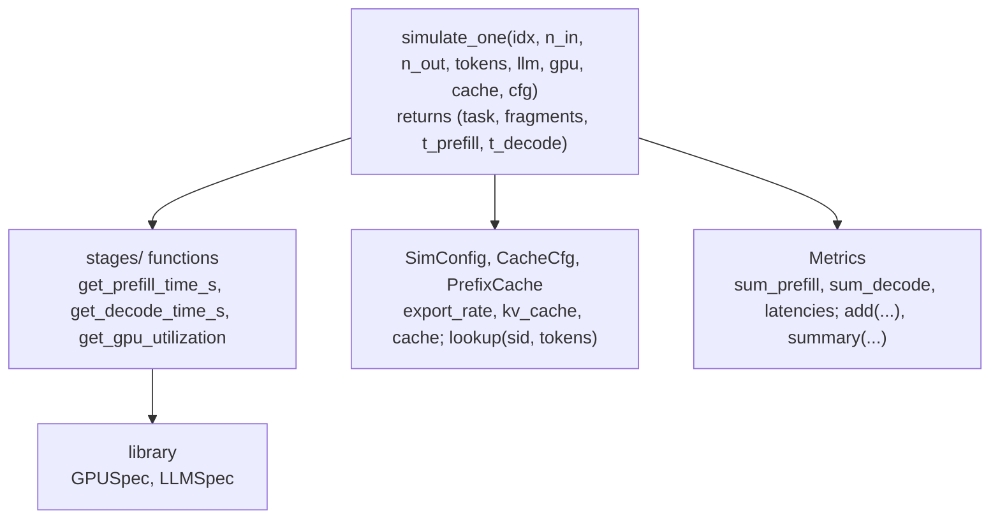

# Performance

The two prediction engines at Kavier's core: a discrete per-request **inference** roofline
simulator, and a first-principles analytical **training**-step model. They share the library but
nothing else — inference and training are different problems.

## Overview {#overview}

The performance component predicts how fast a workload runs and how hard it drives the GPU. It has
two independent engines:

<div class="grid cards" markdown>

-   __Inference__

    `kavier inference` — replays a request trace through a per-request roofline simulator. Predicts
    prefill/decode latency, p50/p95, throughput, and GPU utilisation.

-   __Training__

    `kavier training` — a closed-form model of one fine-tuning step. Predicts step throughput,
    runtime, MFU, memory utilisation and GPU power.

</div>

### Inference (serving) {#inference-overview}

For each request, the simulator (`core/runner.py::simulate_one`) splits work into a **prefill**
stage (encoding the prompt, compute-bound) and a **decode** stage (autoregressive generation,
memory-bandwidth-bound), tracking KV-cache memory and an optional cross-request **prefix cache**.
FLOPs and weight traffic use `active_params`, so it is MoE-aware.

!!! warning "Single-stream by design"

    The inference model is **single-stream**: there is no batching, queueing, or contention.
    "Throughput" is `total_tokens / sum(per-request time)`. Because identical requests take
    identical time, a homogeneous workload yields **p50 == p95** — that is expected, not a bug.

### Training (fine-tuning) {#training-overview}

The training engine (`core/engine.py`) evaluates a closed-form step time — forward + backward +
optimizer + (multi-GPU) gradient all-reduce — then derives throughput and runtime. Raw physics is
then multiplied by fitted **calibration** factors keyed on the exact model/GPU/method. It supports
`full`, `lora` and `gptq-lora` methods.

## How to use it {#use}

### Inference — CLI {#inference}

Point it at a request trace (CSV or Parquet). One row per request: `num_input_tokens`,
`num_output_tokens`, optional `session_id` and token-id lists.

```bash
uv run kavier inference --trace src/kavier/sdk/inference/data/input/input_example.csv
```

| Flag / Option | Type | Default | Description |
|---------------|------|---------|-------------|
| `--llm` | `str` | `Llama-3-8B` | Key of the LLM to simulate (see `LLM_SPEC_LIBRARY`). |
| `--gpu` | `str` | `A10` | GPU model (see `GPU_SPEC_LIBRARY`). |
| `--trace` | `path` | bundled `input_example.csv` | Input trace of per-request token counts (CSV or Parquet). |
| `--output_folder` | `path` | `kavier_output` | Destination directory for the Parquet files & summary. |
| `--kv_cache` | `on \| off` | `on` | Enable/disable vLLM-style KV caching. |
| `--export_rate` | `float` | `0.1` | Snapshot interval **in seconds** for utilisation traces. |
| `--flush_size` | `int` | `1000` | Rows to buffer before writing Parquet (`0` = one-shot). |
| `--prefix_cache_min_tokens` | `int` | `1024` | Minimum prompt length (tokens) to enter the prefix cache. |
| `--max_cached_prompts` | `int` | `10` | Capacity of the prefix cache (LRU). |
| `--cache_scope` | `session \| global` | `session` | Whether the cache key includes `session_id`. |
| `--prefix_cache_policy` | `none \| prefill \| full` | `prefill` | *prefill*: skip prefill on hit. *full*: skip prefill **and** decode. |

Each run writes a timestamped folder containing `tasks.parquet` (one row per request, with a
`duration` latency in ms and a `total_tokens` column) and `fragments.parquet` (GPU-utilisation
snapshots), plus an OpenDC-compatible export; a summary prints to **stdout**:

```text
----------------------------------------------
              SIMULATION SUMMARY
----------------------------------------------
GPU                        | A10
Model                      | Llama-3-8B
Prefix cache               | prefill | >=1024t | session
Prefill time               |   1,234.5s (  0.34 h)
Decode time                |   5,678.9s (  1.58 h)
p95 latency                |     812 ms
Cache hit ratio            |    37.5%
----------------------------------------------
```

### Inference — SDK {#inference-sdk}

The verbs take a batch of workloads and return the input rows plus predicted columns:

```python
import pandas as pd
import kavier

batch = pd.DataFrame(
    [{"model": "Llama-3-8B", "gpu": "A10", "num_requests": 128, "input_tokens": 512, "output_tokens": 128}]
)

kavier.inference.performance(batch)  # + p50_ms, p95_ms, mean_ttft_ms, throughput_tok_s, total_s
```

### Training — CLI {#training}

No trace — training takes a config, either a single one or every row of a CSV:

```bash
uv run kavier training \
  --model_name mistral-7b-v0.1 --method lora \
  --gpu_model NVIDIA-A100-SXM4-80GB --tokens_per_sample 1024 \
  --batch_size 4 --number_gpus 8 --number_nodes 1 \
  --total_tokens 100000000

# or sweep a whole CSV of configs:
uv run kavier training --input_csv src/kavier/sdk/training/data/input/input_example.csv
```

| Flag / Option | Type | Default | Description |
|---------------|------|---------|-------------|
| `--input_csv` | `path` | *(unset)* | Simulate every row of this CSV instead of a single config. |
| `--model_name` | `str` | *required\** | Key of the model to simulate. |
| `--method` | `full \| lora \| gptq-lora` | *required\** | Training / fine-tuning method. |
| `--gpu_model` | `str` | *required\** | GPU model key, e.g. `NVIDIA-A100-SXM4-80GB`. |
| `--tokens_per_sample` | `int` | *required\** | Sequence length — tokens per sample. |
| `--batch_size` | `int` | *required\** | Samples per GPU per step. |
| `--number_gpus` | `int` | *required\** | GPUs per node. |
| `--number_nodes` | `int` | *required\** | Nodes (total GPUs = `number_gpus x number_nodes`). |
| `--total_tokens` | `int` | *(unset)* | Total tokens to train over — sets `train_runtime`. |
| `--opendc_output_dir` | `path` | *(unset)* | If set, export an OpenDC-compatible workload here. |

*\* Required for single-config runs; alternatively pass `--input_csv`.*

!!! tip

    `train_runtime` is `0` unless you pass `--total_tokens` (or `--epochs` + `--dataset_tokens`).
    Without it you still get per-step throughput, MFU and power.

A single-config run prints a JSON object (`train_tokens_per_second`, `train_runtime`, …);
internally the step model also computes `gpu_compute_utilization` (MFU %), `gpu_memory_utilization`
and `gpu_power_watts` — the power figure is what [kavier carbon](co2.md) consumes.

### Training — SDK {#training-sdk}

```python
batch = pd.DataFrame(
    [{
        "model": "mistral-7b-v0.1", "gpu": "NVIDIA-A100-SXM4-80GB", "method": "lora",
        "batch_size": 4, "seq_len": 1024, "num_gpus": 8, "num_nodes": 1,
        "epochs": 3, "dataset_tokens": 5_000_000,
    }]
)

kavier.training.performance(batch)  # + train_tokens_per_second, train_runtime, gpu_compute_utilization, gpu_power_watts
```

Size a job by `total_tokens`, or by `epochs x dataset_tokens`.

### Calibration versions (per use-case) {#calibration-versions}

The training calibration ships as several selectable tables — one per use-case — instead of a
single baked-in fit. Pick one at runtime with `use_calibration("<name>")` (or the
`KAVIER_CALIBRATION` env var, read on first access); `available_calibrations()` lists the shipped
names. The default (unset) is `calibration.json`.

| Name | File | What it is |
|------|------|------------|
| `default` | `calibration.json` | The thesis *exploration* fit (6 LLMs); byte-identical to `6model`. Loaded when nothing is selected. |
| `4model` | `versions/calibration_4model.json` | The thesis *validation* experiment — the dense-4 model set. |
| `6model` | `versions/calibration_6model.json` | The thesis *exploration* experiments — dense-4 + two Granite models. |
| `allmodels` | `versions/calibration_allmodels.json` | Non-thesis: all ~32 calibratable models from the profiling dataset, fit with the any-GPU-count curation (see `kavier calibrate` below). |

```python
from kavier.sdk.training import calibration as cal

cal.available_calibrations()   # -> ['default', '4model', '6model', 'allmodels']
cal.use_calibration("4model")   # a shipped name, or a path to a .json file
kavier.training.performance(batch)  # subsequent predictions apply the selected table
```

### Fitting your own — `kavier calibrate` {#calibrate}

`kavier calibrate` exposes the from-scratch calibration fit (the two-tier regularized-Powell +
per-cell `interaction_scale` recipe that produces `calibration.json`) as a parameterized command,
so you can fit a table from an arbitrary profiling CSV instead of the fixed internal trace. It is
the backend for Coastline's `coastline-tune --method kavier`. It needs the `[calibration]` extra
(`uv sync --extra calibration`).

```bash
uv run kavier calibrate profiling_trace.csv \
  --output cal.json --models granite-3-8b,mistral-7b-v0.1

# then predict against the fitted table:
KAVIER_CALIBRATION=cal.json uv run kavier training --model_name granite-3-8b …
```

| Flag / Option | Type | Default | Description |
|---------------|------|---------|-------------|
| `input` | `path` | *required* | Profiling CSV to calibrate on (fms-hf-tuning columns). |
| `--output` / `-o` | `path` | `-` (stdout) | Where to write the calibration JSON. The summary goes to **stderr**, so `… > cal.json` yields a clean file. |
| `--models` | `str` | *(auto)* | Comma-separated model names to fit. Default: every model with enough valid rows in the file. |

Curation keeps only rows with `is_valid == 1` **and** `dataset_tokens_per_second > 0`, at **any**
GPU count (no `<= 8` cap — unlike the shipped `regenerate()`, which caps at `<= 8`), and targets
`dataset_tokens_per_second`. Robustness: a missing **required** column (`model_name`, `gpu_model`,
`method`, `tokens_per_sample`, `batch_size`, `number_gpus`, `number_nodes`, `is_valid`,
`dataset_tokens_per_second`) is the only hard error; thin/narrow data still fits, and a model with
fewer than 3 rows is skipped with a warning. It reports the held-out (seed-42 split) test MdAPE
overall *and* broken down by model and by GPU-count — for comparing Kavier against other methods
(e.g. TabPFN) across regimes.

!!! warning "Unsuitable-dataset warning"

    If the curated data falls short of the suitability properties — at least 30 valid rows per
    model, at least 2 distinct batch sizes per (model, GPU), at least 2 distinct GPU counts, plus
    the column/coverage checks — a single headline warning names the failing properties. It is
    advisory only: the fit still runs on whatever the data supports.

### UI {#ui}

The interactive REPL (`uv run kavier-ui`) drives both engines from guided menus — pick a simulator,
model, and GPU, enter request or job sizes, and it renders the same metrics and can chain into
energy/carbon.

## Underlying architecture {#architecture}

### Inference engine {#inference-arch}

`simulate_one` is the heart of the request loop: it calls the stage functions, applies the prefix
cache, and emits one OpenDC *task* plus GPU-usage *fragments*. The CLI reaches it via
`cli.py -> core/args.parse_args -> core/service.run_performance`; the SDK reaches it via
`facade.run_inference`.



`simulate_one` calls the `stages/` functions, consults the `PrefixCache` (built from
`SimConfig.cache`), and its timings are accumulated by `Metrics`. The stages read `GPUSpec` /
`LLMSpec` from the [library](library.md).

### Training engine {#training-arch}

`simulate_training_step` computes one step; `simulate_full_training` extrapolates it over the whole
job. Both consult the `calibration` accessors, which read `calibration.json`, and `mse_power` from
the [energy](energy.md) engine.

```mermaid
flowchart TD
    step["simulate_training_step(model, gpu, seq, batch, method, num_gpus, ...)<br/>returns step_time_ms, tokens_per_second, gpu_compute/memory_utilization, gpu_power_watts"]
    full["simulate_full_training<br/>wraps the step over total_tokens; returns train_tokens_per_second, train_runtime"]
    calibration["calibration/ accessors<br/>get_method_scale, get_model_scale, get_multi_gpu_correction, get_interaction_scale, get_mfu_multiplier, get_comm_scale"]
    power["mse_power(compute_u, mem_u, gpu) returns W"]
    library["library<br/>GPUSpec, LLMSpec"]

    full --> step
    step --> calibration
    step --> power
    step --> library
```



The step engine reads `GPUSpec` / `LLMSpec`, multiplies raw physics by the fitted `calibration`
scales, and bills power via `mse_power`. With `calibrated=False` every scale is `1.0` — the
pure-physics baseline.

!!! warning "Calibration is keyed on exact names"

    Calibration is fit only for a handful of models/GPUs whose keys are the *full* names
    (`granite-3-8b`, `NVIDIA-A100-SXM4-80GB`, …). Passing an unfit name — including the short
    inference keys (`Llama-3-8B`, `A100-80GB`) or the default `Llama-3-8B` — silently falls back to
    neutral `1.0` with a one-time `UserWarning`, giving raw uncalibrated physics. Getting a number
    is not the same as getting a calibrated number.

## Formulas {#formulas}

These equations mirror the code (`sdk/inference/stages/` and `sdk/training/core/engine.py`).
Compute/weights use `active_params` (MoE-aware); fixed inference constants are
`COMPUTE_EFFICIENCY = 0.30`, `MEMORY_EFFICIENCY = 0.60`, `PREFILL_OVERHEAD_S = 0.025`.

### Inference (roofline) {#inference-formulas}

**P1 — Prefill time (whole prompt)**

$$
T_\text{prefill} = \text{overhead} + \frac{\text{input\_tokens} \times 2 \times \text{active\_params}}{\text{GPU\_FLOP/s} \times \text{COMPUTE\_EFFICIENCY}}
$$

*Source:* compute-bound single pass
([Vaswani et al., 2017 — Attention Is All You Need](https://arxiv.org/abs/1706.03762)); ~2
FLOPs/param/token, fixed `overhead = 0.025 s`.

**P2 — Decode time (per token, roofline)**

$$
t_\text{token} = \max\!\left( \frac{2 \cdot \text{active\_params}}{\text{FLOP/s} \cdot C_\text{eff}},\ \frac{\text{p\_bytes} \cdot \text{active\_params}}{\text{bandwidth} \cdot M_\text{eff}} \right)
$$

$$
T_\text{decode} =
\begin{cases}
t_\text{token} \times n_\text{out} & \text{(KV cache on)} \\[4pt]
t_\text{token} \times \dfrac{n_\text{out}\,(n_\text{out}+1)}{2} & \text{(off)}
\end{cases}
$$

*Source:* memory-bound autoregressive decode
([Pope et al., 2022 — Efficiently Scaling Transformer Inference](https://arxiv.org/abs/2211.05102);
[Kwon et al., 2023 — PagedAttention](https://arxiv.org/abs/2309.06180)).

- Per token is the slower of the compute- and memory-bound limits (the roofline, F1).
- KV cache changes the *token count*: linear with cache, quadratic without (re-reading the whole
  context each step).

**P3 — KV-cache memory (per token)**

$$
\text{KV\_bytes/token} = \text{layers} \times \text{hidden\_dim} \times 2 \times \text{precision\_bytes}
$$

*Source:* transformer KV state ([Vaswani et al., 2017](https://arxiv.org/abs/1706.03762)). 2x for
Key and Value; utilisation = cached tokens times this, over GPU memory.

### Training (analytical step) {#training-formulas}

**T1 — Forward pass time**

$$
T_\text{forward} = \frac{2 \times \text{active\_params} \times \text{batch} \times \text{seq}}{\text{GPU\_FLOP/s} \times \text{MFU}} + \text{overhead}_\text{cal}
$$

*Source:* forward/backward FLOP accounting —
[Shoeybi et al. (2019) — Megatron-LM](https://arxiv.org/abs/1909.08053);
[Narayanan et al. (2021)](https://arxiv.org/abs/2104.04473); the *6ND* training-FLOP scaling of
[Kaplan et al. (2020) — Scaling Laws](https://arxiv.org/abs/2001.08361).

- ~2 FLOPs per parameter per token (multiply + add); backward is about 2x forward and the optimizer
  add up to the ~6 FLOPs/param/token "6ND" total.
- Uses `active_params`, so sparse/MoE models scale by per-token cost; `overhead` is a calibrated
  per-forward constant.

**T2 — Backward pass time**

$$
T_\text{backward} = 2 \times T_\text{forward}
$$

*Source:* backward is about 2x forward FLOPs —
[Shoeybi et al. (2019)](https://arxiv.org/abs/1909.08053);
[Narayanan et al. (2021)](https://arxiv.org/abs/2104.04473). (Override via `backward_factor`.)

**T3 — Optimizer step time (AdamW)**

$$
T_\text{optimizer} = \frac{20 \times \text{trainable\_params}}{\text{memory\_bandwidth}}
$$

*Source:* 20-byte AdamW memory traffic —
[Rajbhandari et al. (2020) — ZeRO](https://arxiv.org/abs/1910.02054);
[Loshchilov & Hutter (2019) — AdamW](https://arxiv.org/abs/1711.05101).

- Memory-bound: **20 bytes/param** moved per step (grad + two moments + weight, read & written).
- `trainable_params` = all params (full) or the LoRA count (T7).

**T4 — Communication time (ring all-reduce)**

$$
T_\text{comm} = c_\text{cal} \times \left[ \text{latency} \cdot \log_2 N + \text{msg\_overhead} \cdot (N-1) + \frac{\text{grad\_bytes} \cdot (N-1)/N}{\text{bandwidth}} \right]
$$

*Source:* ring all-reduce / MPI collectives —
[Thakur et al. (2005)](https://doi.org/10.1177/1094342005051521);
[Narayanan et al. (2021)](https://arxiv.org/abs/2104.04473).

- Single GPU gives `0`. Multi-node adds an inter-node ring over InfiniBand.
- `grad_bytes = 4 x trainable_params`; `c_cal` is a calibrated scale.

**T5 — Step time & throughput**

$$
T_\text{step} = G_a \times (T_\text{forward} + T_\text{backward}) + T_\text{optimizer} + T_\text{comm}
$$

$$
\text{tokens/sec} = \frac{G_a \times \text{batch} \times \text{seq} \times \text{num\_GPUs}}{\text{mgc} \times T_\text{step}} \times \text{method\_scale} \times \text{model\_scale} \times \text{interaction\_scale}
$$

*Source:* assembled from T1–T4; calibration scales are fitted on a real fine-tuning trace.

- `G_a` = gradient-accumulation steps; `mgc` = multi-GPU correction (per total GPU count).
- With calibration off, every scale = 1 and `mgc` = 1 — the pure-physics baseline.

**T6 — MFU (training), batch-scaled**

$$
\text{MFU} = \text{base\_MFU} \times \text{per\_GPU\_cal} \times \min\!\left(1,\ 0.0341 \cdot \log_2(\text{batch}) + 0.8147\right)
$$

*Source:* Model FLOPs Utilization —
[Chowdhery et al. (2022) — PaLM](https://arxiv.org/abs/2204.02311); roofline
([Williams et al., 2009](https://doi.org/10.1145/1498765.1498785)).

- Log batch-size scaling captures small-batch underutilisation; capped at the GPU's nominal MFU.
- Reported `gpu_compute_utilization` is this raw MFU, *not* the throughput-scaled figure (see
  limitations).

**T7 — LoRA / GPTQ-LoRA trainable params**

$$
\text{trainable\_params} = 2 \times \text{rank} \times \text{hidden\_dim} \times \text{target\_modules} \times \text{num\_layers}
$$

*Source:* [Hu et al. (2021) — LoRA](https://arxiv.org/abs/2106.09685);
[Dettmers et al. (2023) — QLoRA](https://arxiv.org/abs/2305.14314). Defaults in code: `rank = 8`,
`target_modules = 4` (Q, K, V, O).

- Only this count feeds the optimizer (T3) and all-reduce (T4); forward/backward FLOPs still use the
  full model — so LoRA mainly cuts optimizer and communication time.

**F1 — Roofline (shared principle)**

$$
\text{throughput} = \min(\text{peak\_FLOP/s},\ \text{bandwidth} \times \text{arithmetic\_intensity})
$$

*Source:* [Williams et al. (2009) — Roofline](https://doi.org/10.1145/1498765.1498785). Arithmetic
intensity = FLOPs / bytes moved; small batches sit in the memory-bound regime.

## Limitations & accuracy {#limitations}

- **Inference is unvalidated.** Only the training model has a published accuracy figure (~6.2%
  MdAPE, internal held-out data, its calibrated model/GPU set only). The inference simulator has
  **no measured-accuracy validation**.
- **MoE inference over-predicts.** Inference decode uses `active_params` for compute and memory, but
  the KV-cache/utilisation path effectively treats models densely, so MoE latency/energy can
  over-predict by roughly 3-4x. Training correctly uses active parameters.
- **Most models run uncalibrated.** Only the fit-set carries correction factors; everything else
  (including the default `Llama-3-8B`) falls back to neutral raw physics.
- **Calibration may overfit / not extrapolate.** Throughput rests on several multiplicative factors
  fitted on one cluster + dataset; different hardware or data distributions extrapolate beyond the
  fitted regime.
- **Accuracy degrades at high GPU counts.** The shipped tables are meant for 8 or fewer GPUs (where
  the recommender uses predictions); the above-8-GPU multi-GPU correction is a global median over
  the whole catalog's big-GPU runs, and accuracy at very high counts is poor (128-GPU MdAPE above
  30%). See [known weaknesses](known-weaknesses.md).
- **Utilisation vs. throughput bases differ.** Reported GPU compute utilisation is the raw MFU,
  while throughput applies the calibrated scale — the two are not mutually consistent for the same
  run.
- **Hardcoded engine constants.** ~20 bytes/param optimizer traffic, ~5 memory passes/step,
  backward = 2x forward — rules of thumb applied uniformly across models and hardware.

## How to contribute to it {#contribute}

The engines are pure functions over the library, so most changes are small and test-covered.

- **Change inference physics** in `sdk/inference/stages/` (prefill/decode/gpu_usage) or the request
  loop in `core/runner.py`. Tests live in `tests/test_inference/` — `test_stage_invariants.py`,
  `test_runner_invariants.py`, `test_timings.py`.
- **Change training physics** in `sdk/training/core/engine.py`. Tests live in `tests/test_training/`
  — `test_engine.py`, `test_engine_invariants.py`. Calibration regeneration
  (`test_engine_regen.py`) is byte-for-byte deterministic and needs the `calibration` extra;
  **don't hand-edit `calibration.json`** — regenerate it.
- **Follow the invariant pattern.** Invariant tests assert physical laws — monotonicity,
  non-negativity, roofline scaling, KV-off >= KV-on — parametrized over the *whole* GPU x LLM
  library, so a new spec is validated automatically. Regression tests cite the commit/issue they
  guard and hand-derive expected values.

```bash
uv run pytest tests/test_inference tests/test_training -q
uv run pytest -q -k invariant   # just the invariant sweeps
```
